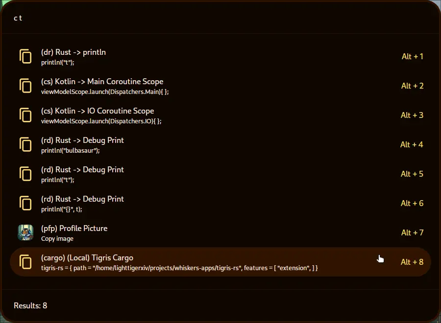

# Clipper

This is an extension for tigris to save your favourite text and images clipboard. Text parameters can accept parameters in order to extend the functionality.

# How to Use
## Edit Clips
To edit clips you can simply type `e` and the title or keyword. Example: `e rd` or `e Rust`

## Parameters
|Parameter|Description|Search Example|Clip|Output|
|--|--|--|--|--|
|{%s}|It replaces the parameter with the whole search text, not including the keyword|rd Hello World!|println!("{%s});|println!("Hello World!");|
|{%X}|It replaces the parameter with the X indexed word of the search text, not including the keyword|rd Cats cute |println!("{%0} are {%1}");|println!("Cats are cute");|

